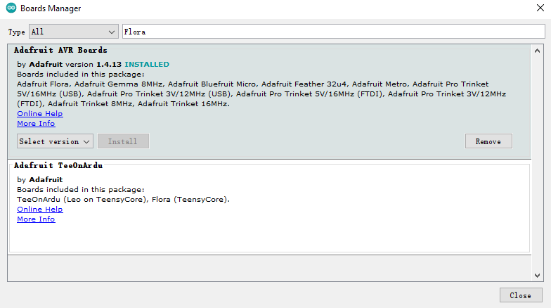

# Intelligent-textile
2021 Spring - Studio 2  
Prototype: https://editor.p5js.org/maoshuochen/sketches/iNm7hLq6G

## 1. Arduino 
### 1.1. Environment Set-up - Board Manager
1. File - Preferences - Additional Boards Manager URLs:  
Adafruit Flora: https://adafruit.github.io/arduino-board-index/package_adafruit_index.json  
ESP8266: http://arduino.esp8266.com/stable/package_esp8266com_index.json

2. Tools - Boards - Boards Manager  

### 1.2. Capacitive Sensor
https://playground.arduino.cc/Code/CapacitiveSensor/

## 2. Audio Visualization (p5.js)
https://editor.p5js.org/maoshuochen/sketches/yU0F-o_1j

## 3. P5.serial - Connect with Arduino
Receive data from arduino serial print  
p5: https://editor.p5js.org/maoshuochen/sketches/_inlk-U0G  
library: https://github.com/p5-serial/p5.serialport  

Environment Set-up:  
Download & Open p5.serial App : https://github.com/p5-serial/p5.serialcontrol/releases

## Further Improvment
Using Websocket to Communicate between the P5.JS and Arduino Wirelessly  
https://www.bilibili.com/video/BV167411H7BA/
